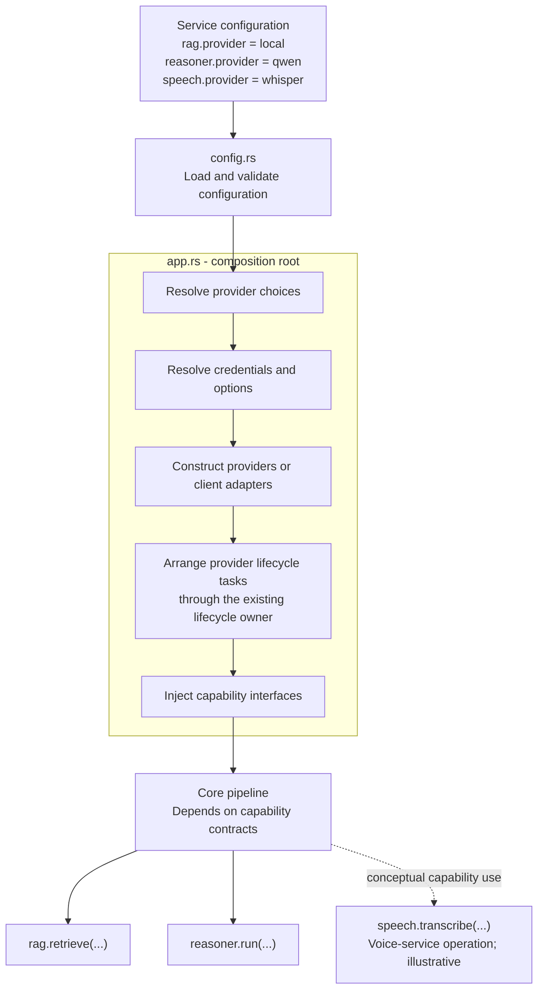
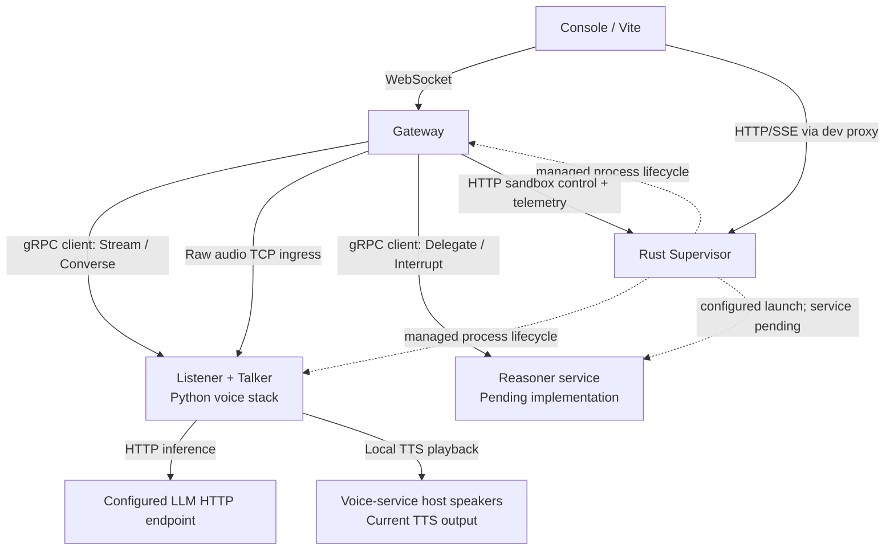

# Project Kaguya — Gateway Specification

**Component:** Gateway (formerly "Router")

**Version:** 0.1.0

**Updated:** 2026-09-18

**Audience:** Developers working on Gateway and adjacent service contracts

**Status convention:** **Current** describes inspected source on
`gateway-refactor`, including the approved R0 extraction after documentation
commit `b4eecd4` (runtime baseline `633ec49`). **Target** describes accepted work
that is not complete. **Deferred** identifies later scope. Source inspection
does not establish passing runtime or end-to-end tests.

The [implementation plan](implementation-plan-v0.1.0.md) owns progress,
dependencies and acceptance gates (R0–R8). The
[protobuf schema](../proto/kaguya/v1/kaguya.proto) owns current wire definitions.
This specification preserves intended contracts while identifying implementation
gaps; describing a gap does not waive the requirement.

---

## 1. Role and Mandate

Gateway coordinates conversation state, prioritized input, context assembly,
tool dispatch, persona delivery and communication with Listener, Talker and
Reasoner. It owns Gateway-local async task/connection lifecycle. Supervisor owns
managed process lifecycle and sandbox resources.

**Current:** The endpoint is the React/Vite Console over WebSocket. OpenPod
integration is deferred; Gateway does not currently speak OpenPod's protocol.
Durable sessions, policy management, application tasks, workspace associations
and execution binding are planned core responsibilities (R1–R5).

Gateway:

- assembles structured context; Talker formats prompts and runs conversational inference;
- forwards raw audio without inspecting or decoding its content;
- receives Talker delegation requests and coordinates their execution;
- preserves P0 control outside the normal Input Stream;
- owns authoritative conversation/application state, with replaceable functionality accessed through capability contracts.

Background LLM history summarization remains an open future implementation
choice. It must not be described as an existing Gateway inference path.

### 1.1 Configuration-Driven Application Composition

**Status:** The structural extraction is implemented: `main.rs` initializes the
runtime/logging and calls `app::run()`; `app.rs` assembles components and awaits
`core/pipeline/run.rs`. Generalized provider selection remains future work.

The core pipeline consumes capability interfaces for replaceable functionality.
Provider selection belongs to application composition. Service configuration
expresses the desired implementation; `config.rs` loads and validates that
configuration; `app.rs` realizes it and injects the resulting capability handles.
`app.rs` consumes the configuration system rather than owning its parsing,
persistence, or configuration-management APIs.

Supervisor URL precedence is resolved by `SupervisorConfig::resolved_url()` in
`config.rs`, called after loading or falling back to default configuration.
Client construction and connection/fallback handling remain in `app.rs`.

The responsibilities of `app.rs` are to:

- resolve configured provider choices and construct local providers or remote
  client adapters;
- pass provider options and resolve credential references through the relevant
  provider setup;
- arrange provider-specific startup and cleanup through the existing lifecycle
  owner, including Gateway-local background tasks;
- assemble the core services and inject capability interfaces into the pipeline.

Provider setup can remain in implementation-local constructors or factories;
`app.rs` coordinates those calls. The pipeline must not branch on provider names
or reach into provider-specific implementation state. Managed process launch,
restart, and sandbox resource ownership remain with Supervisor.
Providers running in another service configure their own internals; Gateway
assembly configures the corresponding client adapter.

Start with explicit constructor injection. Future configuration-driven factories
or provider registration can replace selection at this boundary without changing
pipeline behavior. Core session identity, authoritative history, policy,
workspace association, and execution binding remain ordinary internal modules;
they are not required to implement a universal provider contract. Capability
contracts remain under `capabilities/`, with implementations in their existing
modules. This decision requires no new plugin framework or provider directory.

The diagram describes the target composition flow, not the current deployment
or audio data path. Provider names, configuration keys, and capability calls are
illustrative rather than supported configuration or finalized APIs. In
particular, `speech.transcribe(...)` represents a voice-service capability:
Gateway continues to forward raw audio and consume Listener events without
decoding or transcribing audio itself.




---

## 2. Responsibilities and Implementation Status

| Responsibility | Current implementation | Target / remaining work |
| --- | --- | --- |
| Endpoint I/O | WebSocket JSON text/control ingress, raw audio ingress forwarding, semantic metadata egress | Complete browser TTS egress and recovery in R7; OpenPod is deferred |
| Session and history | Fresh conversation UUID at startup and an in-memory rolling message buffer | Durable identity/history and reconnect/restart continuity in R1 |
| Context assembly | Structured user input, recent messages, memory, retrieval, tools, task summaries and result context | Aggregate size accounting and explicit oversize behavior in R8 |
| Memory retrieval/storage | Built-in `RagEngine` behind `RagCapability`; SQLite, BM25, optional vectors | Future providers remain behind the capability boundary |
| Persona delivery | Load/watch SOUL.md and IDENTITY.md; synthesize memory from RAG; deliver via UpdatePersona | Preserve startup/reconnect behavior through R0/R1 |
| Policy and approval | Local file-path checks and Supervisor backend limits; approval control is a placeholder | Unified policy resolution and correlated approvals in R2 |
| Input/control | P1–P5 channels, separate P0 channel and Talker-output channel | Verify/correct responsiveness under slow work in R0/R8 |
| Tool dispatch | Rust Gateway registry and asynchronous execution; opaque Supervisor handles for `sandbox_exec` | Policy/binding integration and basic tool/MCP inventory decision in R5 |
| Runtime lifecycle | Gateway supervises async work and service connections | Supervisor continues to own process launch, restart and termination |
| Application tasks | Volatile Reasoner request tracking inside the client | Durable task management in R3, actual Reasoner service in R6 |
| Workspace/execution | Configured root for direct file tools; separate sandbox scratch/container state | Logical workspace lifecycle and execution binding in R4/R5 |
| Narration and timing | Intermediate-step filtering, silence timers and post-response prefill hooks | Validate interruption, scheduling and provider failure behavior |
| Observability | Gateway emits telemetry; Supervisor owns its event hub, logs and process metrics | Console integration and end-to-end correlation in R7/R8 |

Scheduled reminders, memory-trigger producers and MCP-triggered ambient events
are not implemented merely because a priority level has been reserved for them.

## 3. The Input Stream

### 3.1 Priority Levels

The intended ordering is human control, human input, initiated work results,
then proactive/ambient work.

| Priority | Source | Current behavior / status |
| --- | --- | --- |
| P0 | STOP, APPROVAL, SHUTDOWN | Separate control channel, first event-loop branch; approval handling remains a placeholder |
| P1 | FinalTranscript, TextCommand | Assemble context and dispatch when Talker is ready; cancel active silence |
| P2 | VadSpeechStart, VadSpeechEnd, PartialTranscript | Speech start requests inline barge-in and mutes output; partials/end events are currently logged |
| P3 | ToolResult, ReasonerStep, ReasonerCompleted, ReasonerError | Record/route results and eligible narration; Reasoner errors are currently logged |
| P4 | SilenceExceeded | Proactive dispatch gated by configuration, readiness and generation state |
| P5 | Telemetry | Channel/event placeholder; OpenPod ambient producers are deferred |

### 3.2 Ordering and Responsiveness

**Target:** STOP must remain responsive and lower-priority work must not override
user interaction. P0 bypasses the Input Stream entirely.

**Current limitation:** A biased `tokio::select!` chooses among ready branches;
it does not preempt an already-running branch. Retrieval, history access,
provider calls and action execution may be awaited inside that branch. P3
speech-state coordination and P0 latency under slow work require R0/R8
validation. Queue priority alone is not a guarantee that a result cannot
interrupt a user who has started speaking.

### 3.3 Implementation

[Input stream](../gateway/src/core/input_stream.rs) creates five P1–P5
`tokio::sync::mpsc` channels. P0 and Talker outputs have separate channels in
[app.rs](../gateway/src/app.rs). Internal events are Rust types; cross-service
semantic messages use protobuf. The event loop lives in
[core/pipeline/run.rs](../gateway/src/core/pipeline/run.rs); P0 remains separate
from the input queues and handlers. Long-await responsiveness work remains open.

## 4. Memory System

### 4.1 Built-in Hybrid RAG

**Current:** [RagEngine](../gateway/src/rag/mod.rs) implements
[RagCapability](../gateway/src/capabilities/rag.rs). The pipeline consumes the
capability; the details here describe the built-in implementation, not a
requirement that all providers use SQLite.

Storage is configured through `[rag] db_path` (currently `data/kaguya.db`,
relative to Gateway's working directory). [RagStore](../gateway/src/rag/store.rs)
creates:

- `memories`: typed conversation/fact/preference/project content, source turn and creation timestamp;
- `memories_fts`: FTS5 index maintained by triggers, using `porter unicode61` (REF-009);
- `embeddings`: optional vector data keyed by memory;
- `user_profile` and `projects`: schema tables that the current ingestion/export path does not use.

For a nonempty user query, [retrieval](../gateway/src/rag/retriever.rs) combines
BM25 and optional vector cosine-similarity rankings using reciprocal rank fusion
(REF-007), limits the result count by configured `top_k` (REF-008), and applies
an optional per-result content cap. The current ranker uses the REF-007 constant;
do not infer that every algorithm parameter already has configuration plumbing.
`RetrievalResult` carries id, content, source and score.

Memory extraction uses English/Chinese keyword rules and stores typed rows.
The optional embedder waits for notification, then processes unembedded rows
against the configured `/v1/embeddings` endpoint. It is not an independent
periodic polling service or a guaranteed startup backfill.

`export_memory_md()` reads typed rows from `memories` to produce preferences,
projects and recent conversation/fact sections. It does not read the separate
`user_profile`/`projects` tables. Storage-time and output-time content caps
are separate (REF-010); retrieval/export caps are optional. There is no universal
200-character bound.

### 4.2 History and Durable Session State

**Current:** [History](../gateway/src/core/history.rs) stores recent
`ChatMessage` values in memory and discards older entries. Despite the
`max_recent_turns` setting name, selection/truncation counts messages, not
complete user/assistant exchanges. There is no summary, durable transcript or
restart reload, and startup creates a new conversation UUID.

**Target (R1):** Durable session identity and authoritative history support a
continuous conversation across connection/process restarts. Prompt-window
selection must be separate from transcript retention. Session identity does not
require a multi-chat UI. Storage format, retention, history compaction and the
relationship between session and conversation IDs remain open.

RAG memories remain derived knowledge, not a substitute for authoritative
conversation history.

### 4.3 Memory Hydration Flow

```text
Startup:
  load persona files and open the configured RAG store
  export memory markdown
  Talker connection/recovery loop delivers PersonaConfig

P1 user input when Talker is ready:
  retrieve relevant memories
  fetch recent history, tool definitions and active-task descriptions
  assemble TalkerContext
  append user history and dispatch Converse

Persona file change:
  reload changed SOUL.md or IDENTITY.md
  export current memory and update the shared persona snapshot
  push UpdatePersona when possible
```

`memory_md` is synthesized data, not a watched file. Current user-history
appending is gated by Talker readiness; R1 must define durable handling of input
received while the provider is unavailable.

### 4.4 Post-Response Processing

[Pipeline handlers](../gateway/src/core/pipeline/handlers.rs) distinguish
response history from RAG ingestion:

- Non-interrupted, nonempty responses append assistant text to history.
- Only eligible `UserIntent` responses with a preceding user input invoke memory extraction; tool continuations, Reasoner narration/results and silence rounds do not create fresh user/assistant memory pairs.
- Non-interrupted completion checks for changed memory, pushes updated persona when needed, and requests prefix prefill.
- An interrupted response skips that normal completion path. A received `BargeInAck` contributes only its confirmed-spoken text.
- Completion resets turn state, unmutes output and restarts the silence cascade.

The user entry is appended during user-input handling, not as a new paired
record after every response. R1/R8 must verify interruption and duplicate-event
behavior rather than assuming the current in-memory flow provides durable
delivery guarantees.

### 4.5 Future Evolution and Limits

LLM-based extraction, alternative embedding providers and reranking remain
possible extensions. A vector-store migration threshold requires measurement;
the old approximate corpus-size trigger is not a settled rule. Storage/schema
compatibility must be evaluated for whichever design is selected.

R8 retains aggregate context-size accounting and clear oversize behavior as
unfinished requirements. Optional per-field caps alone do not establish that a
complete TalkerContext fits transport or model limits.

## 5. Turn Lifecycle (Inline Barge-In on Converse Stream)

The current interruption message is `TalkerInput.barge_in`, with
`TalkerOutput.barge_in_ack` carrying `spoken_text` and `unspoken_text`.
There is no separate Prepare RPC or partial_response message in the current
schema.

### 5.1 Voice Input Flow

```text
Console raw audio → Gateway byte forwarding → Listener
Listener speech onset → VadSpeechStart [P2]
Gateway cancels silence, requests inline barge-in, mutes its output
  if an active Converse sender exists:
    Talker sets generation cancellation and stops TTS
    Talker queues BargeInAck with spoken/unspoken text
    Gateway records received spoken text and unmutes output

Listener final transcript → FinalTranscript [P1]
Gateway checks Talker readiness, retrieves memory and assembles context
Gateway dispatches a new Converse round
Talker formats the prompt, streams model tokens internally,
  emits semantic events and plays TTS locally
ResponseComplete → conditional post-response work and silence timers
```

This is a source-level control flow, not a measured latency trace. Current TTS
accounting is conservative and sentence-based, not a word-accurate split.
`ResponseComplete` reports generation completion; it does not establish that
all queued speech finished playing. Browser TTS routing and complete
interruption accounting remain R7/R8 acceptance work.

### 5.2 Text Input Flow

```text
Console JSON text message → TextCommand [P1]
Gateway checks readiness, fetches retrieval/history/tools/task descriptions
User-intent handler cancels silence and the prior dispatch token,
  appends user history and starts the new Converse round
```

**Current limitation:** The P1 handler does not emit a separate inline barge-in
action. Cancelling its dispatch token is not equivalent to proving receipt of
a BargeInAck. R1/R7/R8 must validate text interruption, playback cancellation
and preservation of confirmed-spoken history. The desired behavior remains
responsive interruption with accurate history.

### 5.3 False Positive VAD

Speech onset can interrupt a response even when no final transcript follows.
Current silence cancellation/restart depends on received events: completion
restarts timers, while an idle/no-stream onset does not itself schedule recovery.
Silence-triggered generation is also disabled in the checked-in Gateway config.

A guaranteed spoken recovery after a fixed delay is therefore not current
behavior. False-onset recovery and idle barge-in remain validation work;
a two-stage fade/stop design is deferred.

## 6. Delegation Flow

**Current integration:** Talker emits a DelegateRequest with a task ID and
description. Gateway's [ReasonerManager](../gateway/src/clients/reasoner.rs)
tracks a volatile request, connects to the Reasoner endpoint as a gRPC client,
opens Delegate, and adapts supported outputs into P3 events. It does not spawn a
Reasoner OS process. Intermediate/output descriptions feed narration; completion
feeds a summary continuation; errors are currently logged by the event loop.

**Current limitation:** The Reasoner package has no service implementation.
Connection exhaustion currently triggers simulated progress/completion in the
Gateway client. Those events are not evidence of real task execution.

**Target (R3–R6):**

1. Own task identity/lifecycle outside the transport client.
2. Resolve session, workspace and policy into an authorized execution binding.
3. Coordinate actual Reasoner availability through Supervisor-owned process lifecycle.
4. Dispatch to the configured backend through the Reasoner service.
5. Correlate progress, approvals, cancellation, failures and results with durable task state.

Backend selection, backend-session lifetime and process reuse remain open.
One OS process per task is not a settled requirement. Normal provider failure
must not become simulated success.

## 7. Tool Dispatch Flow (Asynchronous)

```text
Talker emits ToolRequest, e.g. list_files with {"path":"."}
Gateway validates the tool name and dispatches registered work
  filesystem tools → current Gateway file-tool implementation
  sandbox_exec → Supervisor acquire/execute through an opaque handle
Result → ToolResult [P3]
Gateway records the result and, when Talker is ready,
  builds a result context and dispatches a continuation
```

The current [registry](../gateway/src/tools.rs) is Rust code in Gateway. It
advertises list_files, read_file, write_file and conditionally sandbox_exec.
There is no implemented standalone TypeScript Toolkit, web_fetch or tool search.
R5 resolves the intended inventory and any separate Toolkit proposal.

Execution is spawned asynchronously, but result processing and other event-loop
work still include awaits. This is not a claim that the complete Gateway hot
path cannot block. The protocol also does not guarantee that a model stops
generating immediately after emitting a tool tag.

## 8. Silence Timer Management

[SilenceTimers](../gateway/src/core/silence.rs) runs a cancellable cascade using
configured absolute elapsed targets from the latest start. The REF-001 defaults
are 3 seconds for a soft prompt, 8 seconds for follow-up, and 30 seconds for
context shift; they are not cumulative sleeps of 3 + 8 + 30 seconds.

Speech onset and user input cancel active silence. Response completion restarts
it. The handler dispatches only when proactive silence behavior is enabled,
Talker is ready and no generation is active.

The checked-in [gateway.toml](../gateway/gateway.toml) sets
`[silence] enabled = false`: timers may tick, but proactive LLM dispatch is
suppressed. Further re-engagement policy and actual playback timing require
validation; no automatic spoken follow-up is guaranteed by the presence of a
timer event.

## 9. Deliberative Narration Protocol

The intended experience has three parts:

1. **Acknowledgment:** Talker can acknowledge delegated work in its original response. Receiving DelegateRequest does not itself dispatch another acknowledgment round.
2. **Progress narration:** Gateway filters duplicate/rate-limited descriptions and suppresses narration while it is already generating or Talker is unavailable.
3. **Resolution:** A completed task summary is recorded and supplied to Talker for a continuation when available.

The current [NarrationFilter](../gateway/src/core/narration.rs) compares exact
descriptions and elapsed time. It is not a semantic state-transition classifier
or a batching/merging system. Tuning is currently supplied by startup code;
exposing it through configuration and recording an adopted default remain work
for R6/R8. No acknowledgment latency or narration cadence is asserted here as
a measured guarantee.

## 10. Speculative Prefill Orchestration

**Current:** Non-interrupted completion asks Talker to prefill the next context.
Changed memory is pushed through UpdatePersona first. Talker's HTTP LLM client
uses the backend's prefill/cache options; benefit depends on backend support.
A Reasoner completion dispatches result context, but does not by itself
unconditionally refresh persona or run prefill before that response completes.

The GPU is not necessarily idle: TTS, embeddings or other inference can overlap.
R8 must measure latency benefit and contention.

**Deferred:** Incremental prefill from partial transcripts. Current partials are
logged rather than forwarded as cache-extension requests. Invalidation when the
user's meaning changes is still an open design question.

## 11. Endpoint Ingress/Egress Routing

### Current Console

The [Axum endpoint](../gateway/src/services/endpoint.rs), behind the
`dev-console` feature, serves `/ws`, `/health`, `/capabilities/status` and
`/runtime/status`. The React/Vite Console proxies its Gateway connection;
Supervisor HTTP/SSE traffic uses the Console's separate development proxy.

```text
Console → Gateway /ws:
  JSON {"type":"text","content":"..."} → P1
  JSON {"type":"control","command":"stop"|"shutdown"} → P0
  binary audio → Listener audio connection

Gateway → Console /ws:
  JSON semantic metadata → turn display
  binary audio receiver/send path exists, but has no Talker TTS producer yet

Console → Supervisor HTTP/SSE:
  app/process actions, status, logs and available telemetry APIs
```

The endpoint permits one active WebSocket client; a new connection replaces the
previous one. It is a network transport, even when used on localhost.
The Console currently has no durable session bootstrap or approval interaction;
R1/R2/R7 introduce those contracts.

### Deferred OpenPod

OpenPod would supply text/audio/control and ambient events, with Gateway handling
its protocol boundary. Raw audio must remain outside protobuf serialization.
The exact endpoint integration and compatibility strategy are future work;
Console remains the current development interface.

## 12. Output Stream

**Current metadata:** Gateway emits sentence, emotion, response-started,
response-complete and voice user-input events to Console. Tool/task detail,
authoritative session identity, typing and presence are not all implemented
merely because the UI may eventually need them.

**Current audio:** Talker plays speech on its host. Gateway's
[OutputManager](../gateway/src/core/output.rs) has audio mute/forward primitives
and the endpoint can send binary frames, but no current caller supplies TTS
audio to that path. Browser playback code expects PCM; an implemented
Opus-encoded browser egress stream must not be assumed.

**Target (R7):** Transport Talker speech to the endpoint through Gateway without
decoding it there; agree codec/sample-rate and playback/interruption behavior.
Keep semantic metadata independent of audio-frame transport. Verify how queued
audio is stopped and how playback completion relates to turn/history events.

## 13. Talker Egress — What Gateway Receives

The current TalkerOutput oneof is defined in the canonical schema:

| Payload | Gateway handling |
| --- | --- |
| ResponseStarted | Reset response accumulation and emit turn-start metadata |
| SentenceEvent | Accumulate assistant text and forward sentence metadata |
| EmotionEvent | Forward emotion metadata |
| ToolRequest | Dispatch a known tool or record an unknown-tool error |
| DelegateRequest | Start Gateway-side Reasoner request coordination |
| BargeInAck | Append nonempty spoken_text and unmute; unspoken_text is not appended |
| ResponseComplete | Conditional history/RAG/persona/prefill work, reset state, restart silence and emit completion metadata |

Messages have a sequence field; runtime ordering and interruption races still
need acceptance coverage. Token streaming and audio processing remain inside
the voice service. Raw speech audio is not a TalkerOutput protobuf payload.

## 14. Workspace, Policy and Execution Binding

**Current:** Direct Gateway file tools resolve paths against the configured
workspace root and perform local checks. sandbox_exec uses Supervisor-owned
scratch/container state. Those paths are not yet one shared logical workspace,
and path checks alone are not a complete user-policy system or a proof of
isolation.

**Target (R1–R5):** Gateway owns session/task/workspace associations and policy
resolution. Execution binding connects those identities and constraints to an
environment-specific path and opaque runtime handle. Supervisor provides and
cleans up runtime resources; the selected backend enforces the guarantees it
actually supports.

Talker tools and Reasoner work should share the intended logical workspace,
while permissions, process/host placement and physical paths can differ.
A Reasoner adapter must use the authorized scope rather than independently
granting itself broader access. Materialization, shared edits, publication,
retention and restart recovery remain open until their contracts are recorded.
Releasing access, unregistering a workspace and deleting files are distinct
operations to define.

**MCP:** Basic server/tool integration remains an unresolved delivery item in R5;
MCP clients and search_tools are not implemented. Advanced tool search and
multi-tool scripting remain deferred.

**Ambient telemetry:** Host activity arriving from OpenPod is deferred and
distinct from the current Supervisor logs/process metrics/event hub.

## 15. IPC Protocol

The [canonical proto](../proto/kaguya/v1/kaguya.proto) defines the RPC contract.
This table summarizes ownership without duplicating schema bodies:

| Interface | Client | Server | Current status |
| --- | --- | --- | --- |
| ListenerService.Stream | Gateway | Listener inside voice stack | Implemented bidi stream |
| TalkerService.Converse / PrefillCache / UpdatePersona | Gateway | Talker inside voice stack | Implemented |
| ReasonerService.Delegate / Interrupt / Telemetry | Gateway or designated subscriber | Reasoner | Schema and Gateway delegation client exist; service pending |
| RouterControlService.SendControl | External control caller | Gateway | STOP/SHUTDOWN paths exist; approval semantics pending |
| Supervisor HTTP/SSE | Gateway and Console proxy | Supervisor | Process, sandbox, status/log/telemetry APIs |
| Console WebSocket | Browser Console | Gateway | JSON semantic messages and separate binary audio frames |

Current service IPC uses TCP. Gateway sends Listener audio as
`[u32 big-endian length][raw bytes]` on the separately configured audio
connection. Listener accepts configured PCM input or decodes configured Opus;
the browser currently sends PCM. Gateway never decodes these bytes.

Proto changes must regenerate Python stubs, rebuild Rust clients/servers, and
pass buf checks. TypeScript Reasoner is planned to load the schema at runtime.
Adding session/task/policy/binding fields is active work, not present wire state.

## 16. Implementation

| Attribute | Current implementation |
| --- | --- |
| Language/runtime | Rust; default multithreaded Tokio runtime |
| gRPC | tonic; inbound control service, outbound voice/Reasoner clients |
| Web endpoint | Axum, enabled by dev-console |
| Persona files | tokio::fs plus notify watcher |
| Built-in RAG | rusqlite with bundled SQLite/FTS5; optional HTTP embedder |
| Configuration | gateway.toml for local behavior; kaguya.runtime.toml for process/capability topology and Supervisor sandbox settings |
| Runtime state | In-memory history, turn state, active Reasoner requests and connections; RAG SQLite persists independently |
| Provider assembly | app.rs constructs components; main.rs initializes runtime/logging; pipeline::run handles the event loop |
| Process/sandbox lifecycle | Supervisor; not Gateway |

### 16.1 Process Layout

Solid arrows below show connection initiation or the stated audio path, not the
direction of every message on a bidirectional connection. Dotted arrows show
Supervisor ownership; the Reasoner service itself remains pending.



Providers may be external under a runtime profile; the diagram does not require
Supervisor to launch an externally managed LLM endpoint. Console development
startup bootstraps the Rust Supervisor; app process ownership remains there.

## 17. Phased Delivery

The [implementation plan](implementation-plan-v0.1.0.md) is the authoritative
progress checklist. This mapping replaces the old mixed Phase 1/Phase 2 claims
without declaring incomplete functionality delivered.

| Stage | Gateway-relevant outcome |
| --- | --- |
| Existing baseline | Event handling, voice clients, RAG, persona, local tools, reconnect, sandbox client and Console endpoint |
| R0 | Assembly/event-loop extraction implemented; validation evidence is recorded in the plan; P0 scheduling correction remains R8 work |
| R1 | Durable session identity, history and resume APIs |
| R2 | Policy resolution and correlated approval |
| R3 | Durable application task ownership/lifecycle |
| R4 | Workspace identity, association and lifecycle |
| R5 | Workspace/policy-aware execution binding to Supervisor; resolve basic tool/MCP inventory |
| R6 | Real Reasoner service and provider integration |
| R7 | Complete Console domain views, recovery and browser voice path |
| R8 | Context limits, P0 responsiveness, interruption/recovery and cross-platform acceptance |

Deferred scope includes OpenPod, incremental partial-transcript prefill,
two-stage barge-in, advanced tool search/programmatic calling, and richer
memory extraction. Basic MCP remains tracked in R5 rather than silently
removed. History summarization remains an open compaction choice rather than
an existing feature.

## 18. Open Questions (Gateway-Relevant)

- **Identity and durable history:** Session/conversation ID relationship, startup selection, storage format, retention and replay/duplicate handling.
- **Policy and task lifecycle:** Precedence, grant scope/revocation, approval timeout/disconnect behavior, task transitions and restart/cancellation semantics.
- **Workspace and execution:** Existing workspace versus checkout/snapshot, concurrent edits, runtime path mapping, supported isolation guarantees, publication and cleanup.
- **Provider integration:** Initial Reasoner adapters, backend session lifetime and capability contracts; illustrative provider names in §1.1 do not select them.
- **Context limits and compaction:** Aggregate size accounting, transport/model limits, overflow behavior and possible summarization. Adopted limits require rationale and configuration.
- **Control responsiveness:** Scheduling/cancellation during slow calls, user speech versus P3 results, and measured STOP behavior.
- **Audio and interruption:** Browser egress codec, playback completion, idle/false-onset recovery, and spoken-history accuracy during text/voice interruption.
- **Memory quality and scaling:** Extraction quality, reranking, vector-store need and schema migration; use measurements rather than a fixed unsupported corpus threshold.
- **Prefill and hardware:** Backend cache support, invalidation, benefit and GPU contention with STT/TTS and concurrent work.
- **OpenPod transport:** Define raw-audio framing and endpoint compatibility while preserving the rule that audio bytes never enter protobuf serialization.
