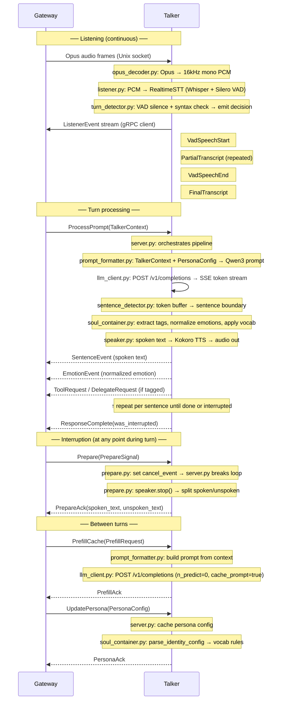

# kaguya-talker

Process 2 of the Kaguya system. The Talker Agent handles all audio I/O and LLM
inference for a single conversation turn:

- **main.py** — asyncio entrypoint: starts gRPC server + Listener task
- **config.py** — `TalkerConfig` (pydantic-settings, `KAGUYA_*` env vars)
- **server.py** — `TalkerServiceServicer`: orchestrates inference ↔ voice per turn
- **prepare.py** — PREPARE signal handler (cancel inference + stop TTS)
- **voice/opus_decoder.py** — Opus → 16kHz mono PCM (opuslib wrapper)
- **voice/listener.py** — RealtimeSTT (Whisper + Silero VAD) → turn detection → `ListenerEvent` gRPC stream to Gateway
- **voice/turn_detector.py** — Rule-based end-of-turn detection (Phase 1; Phase 2 replaces with LiveKit learned model, see REF-004)
- **voice/speaker.py** — Spoken text → Kokoro TTS → audio out
- **inference/prompt_formatter.py** — `TalkerContext` + `PersonaConfig` → Qwen3 chat-template prompt
- **inference/llm_client.py** — Async HTTP streaming to OpenAI-compatible LLM server
- **inference/sentence_detector.py** — Token buffer → sentence boundary detection
- **inference/soul_container.py** — Tag extraction, emotion normalization, vocabulary rules

Specs: `../docs/spec-agent-v0.1.0.md`. Implementation plan: `../docs/implementation-plan-v0.1.0.md`.

---

## Quick Start (End Users)

**Proto stubs and opus.dll are already committed** — no setup needed!

```sh
git clone kaguya
cd kaguya/talker
conda create -n kaguya python=3.11 -y
conda activate kaguya
pip install uv
uv sync
pytest  # ✅ works immediately
```

---

## Prerequisites (Runtime)

- **llama.cpp server** — running Qwen3-8B Q4 on `http://localhost:8080`
- **Gateway** — running and listening on `/tmp/kaguya-gateway.sock`

---

## Environment Setup

The project uses **conda for Python version management** and **uv for Python packages**. On Windows, opus.dll is bundled in `native/win32/` — no conda packages needed for native libraries.

### First-time setup

```sh
# 1. Create conda environment
conda create -n kaguya python=3.11 -y
conda activate kaguya

# 2. Install uv
pip install uv

# 3. Install all Python dependencies
cd talker
uv sync
```

### Adding/removing dependencies

```sh
uv add <package>
uv remove <package>
```

### Native Dependencies (Windows)

- **opus.dll** is bundled in `native/win32/` — no conda install needed
- For Linux/macOS: Install via system package manager
  ```sh
  # Linux
  sudo apt install libopus0

  # macOS
  brew install opus
  ```

---

## Running

```sh
# From talker/, with conda env active
conda activate kaguya
python main.py
```

**Configuration:**
- Logs: stdout at level `KAGUYA_LOG_LEVEL` (default `INFO`)
- Override via `KAGUYA_*` env vars or `.env` file in repo root

---

## Development

### Regenerating Proto Stubs (After Schema Changes)

**End users don't need this** — stubs are committed. Only for developers changing `proto/kaguya/v1/kaguya.proto`:

```sh
# Option 1: From repo root
make proto

# Option 2: From talker/
python scripts/gen_proto.py

# Then commit the updated stubs
git add proto/
git commit -m "proto: update schema"
```

### Running Tests

```sh
conda activate kaguya
pytest -v
```

---

## Architecture Notes

- **Stateless:** All context arrives via gRPC from Gateway each turn
- **Shared process:** Listener and Speaker run as separate asyncio tasks (not threads)
- **Proto imports:** Use relative imports (`from . import kaguya_pb2`) — package-safe
- **opus.dll:** Bundled in `native/win32/`; prepended to PATH and registered via `os.add_dll_directory()` at import time so opuslib's `find_library` resolves it without system installation

### Data Flow



See `REFERENCES.md` for design decision rationale.
