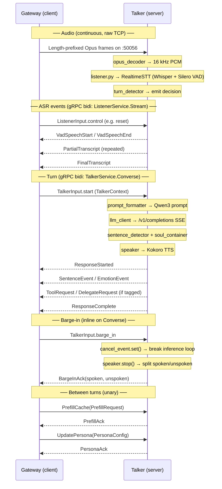

# kaguya-talker

Process 2 of the Kaguya system. Owns voice I/O and LLM inference for one
conversation turn.

## Modules

- **main.py** — asyncio entrypoint: starts both gRPC servers + Listener task.
- **config.py** — `TalkerConfig` (pydantic-settings, `KAGUYA_*` env vars).
- **server.py** — `TalkerServiceServicer`: bidi `Converse` for inference +
  inline barge-in, plus unary `PrefillCache` and `UpdatePersona`.
- **voice/opus_decoder.py** — Opus → 16 kHz mono PCM (opuslib wrapper). Loads
  the system `libopus` on macOS/Linux; on Windows uses the bundled
  `native/win32/opus.dll`.
- **voice/listener.py** — Two roles in one module:
  - `ListenerServiceImpl`: gRPC server (Gateway dials us) — yields ASR events.
  - `Listener`: owns RealtimeSTT, a raw TCP socket on `:50056` for incoming
    audio frames, the turn detector, and the event queue feeding the gRPC.
- **voice/turn_detector.py** — Rule-based end-of-turn detection (Phase 1; see
  REF-004 for the planned Phase 2 learned model).
- **voice/speaker.py** — Spoken text → Kokoro TTS → audio out.
- **inference/prompt_formatter.py** — `TalkerContext` + `PersonaConfig` →
  Qwen3 chat-template prompt.
- **inference/llm_client.py** — Async HTTP streaming to the OpenAI-compatible
  LLM server (`/v1/completions`).
- **inference/sentence_detector.py** — Token buffer → sentence boundaries.
- **inference/soul_container.py** — Tag extraction, emotion normalization,
  vocabulary rules.

Specs: [`../docs/spec-agent-v0.1.0.md`](../docs/spec-agent-v0.1.0.md).
Implementation plan: [`../docs/implementation-plan-v0.1.0.md`](../docs/implementation-plan-v0.1.0.md).

---

## Prerequisites

- **LLM server** — OpenAI-compatible `/v1/completions` endpoint, default
  `http://localhost:8080`. llama.cpp, LM Studio, or vLLM all work.
- **Gateway** — running on `127.0.0.1:50051` (control gRPC). Not required
  to bring up the Talker process for testing — it runs standalone and
  waits for the Gateway to connect.

---

## Setup

The Talker uses **uv** for Python environment + dependency management.
On Python 3.13 you also need the `audioop-lts` backport (declared in
`pyproject.toml` with a python-version marker, so 3.11/3.12 envs skip
it automatically).

### macOS (Apple Silicon or Intel)

```sh
# 1. System libraries
brew install uv portaudio opus

# 2. Project dependencies (from talker/)
uv sync --dev

# 3. Run
uv run python main.py
```

That's it. `uv sync` reads `pyproject.toml` + `uv.lock`, downloads a
matching Python (3.11+), and creates `talker/.venv/`. `audioop-lts` and
all transitive deps install automatically. `libopus` is discovered via
`DYLD_FALLBACK_LIBRARY_PATH` — `voice/opus_decoder.py` appends both
Homebrew prefixes (`/opt/homebrew/lib`, `/usr/local/lib`) at import time.

If you also need the Rust gateway and the proto/lint tooling:

```sh
brew install buf protobuf
uv tool install ruff
uv tool install mypy
# rustup via the official installer (brew rustup-init also works):
curl --proto '=https' --tlsv1.2 -sSf https://sh.rustup.rs | sh
```

### Linux / WSL

```sh
sudo apt install build-essential portaudio19-dev libopus-dev espeak-ng
# uv installer (or apt install pipx && pipx install uv):
curl -LsSf https://astral.sh/uv/install.sh | sh
cd talker && uv sync --dev
```

| Package           | Why                                              |
| ----------------- | ------------------------------------------------ |
| `build-essential` | C compiler for PyAudio (no prebuilt linux wheel) |
| `portaudio19-dev` | PortAudio headers for PyAudio (mic capture)      |
| `libopus-dev`     | Opus codec for opuslib                           |
| `espeak-ng`       | Phoneme engine for Kokoro TTS                    |

#### WSL2 audio passthrough (mic input)

```sh
sudo apt install libasound2-plugins
echo 'pcm.default pulse
ctl.default pulse' > ~/.asoundrc
pactl info  # should report RDPSource/RDPSink (provided by WSLg)
```

Microphone access also needs to be enabled on the Windows side:
**Settings → Privacy & Security → Microphone → Let desktop apps access
your microphone**.

### Windows

`opus.dll` ships in `talker/native/win32/` — no system install needed.
Install Python 3.11+ and uv via your preferred method, then:

```powershell
cd talker
uv sync --dev
uv run python main.py
```

---

## Running

```sh
# From talker/
uv run python main.py
```

Configuration via `KAGUYA_*` env vars or a `.env` file in the repo root.
Common ones:

| Var                            | Default              | Notes                              |
| ------------------------------ | -------------------- | ---------------------------------- |
| `KAGUYA_LOG_LEVEL`             | `INFO`               | Logger level                       |
| `KAGUYA_LLM_BASE_URL`          | `http://localhost:8080` | OpenAI-compatible endpoint      |
| `KAGUYA_TALKER_LISTEN_ADDR`    | `0.0.0.0:50053`      | TalkerService gRPC bind address    |
| `KAGUYA_LISTENER_GRPC_ADDR`    | `0.0.0.0:50055`      | ListenerService gRPC bind address  |
| `KAGUYA_LISTENER_AUDIO_ADDR`   | `0.0.0.0`            | Raw TCP audio socket bind address  |
| `KAGUYA_LISTENER_AUDIO_PORT`   | `50056`              | Raw TCP audio socket bind port     |

### macOS port-binding gotcha

macOS allocates ephemeral source ports from 49152–65535 — the same range
the default Kaguya ports live in. Outbound connections (DNS lookups,
HuggingFace model fetches) can transiently hold ports as TIME_WAIT
corpses; binding to `0.0.0.0:PORT` then fails with `EADDRINUSE` because
the kernel requires the port to be free on every interface. Loopback is
its own interface and not affected. Easiest workaround:

```sh
KAGUYA_TALKER_LISTEN_ADDR=127.0.0.1:50053 \
KAGUYA_LISTENER_GRPC_ADDR=127.0.0.1:50055 \
KAGUYA_LISTENER_AUDIO_ADDR=127.0.0.1 \
uv run python main.py
```

Phase 1 is local-only anyway, and the Gateway already dials Talker on
loopback (`config/gateway.toml`'s `clients.*_addr`).

---

## Development

### Regenerating proto stubs

End users **don't need this** — stubs are committed under `talker/proto/`.
Only run after editing `proto/kaguya/v1/kaguya.proto`:

```sh
# From repo root
make proto

# Or from talker/
uv run python scripts/gen_proto.py
```

The script generates Python + mypy `.pyi` stubs into `talker/proto/`
(flat layout, matching the `from proto import kaguya_pb2` imports).

### Running tests

```sh
uv run pytest -v
```

The `tests/test_grpc_handshake.py` regression test exercises the bidi
`Stream` and `Converse` handshakes against an in-process server, which
catches the metadata-flush bug if anyone reverts that fix.

### Test harness (deprecated)

`scripts/mic_to_listener_harness.py` was a single-process harness from
before the Listener/Gateway gRPC role flip. It is currently **broken** —
it dials Gateway as a gRPC client and uses removed proto messages
(`ListenerEvent`, `StreamEvents`). Pending rewrite. See the file's
top-of-file warning for details.

For end-to-end testing without a real microphone, use the Gateway's
WebSocket text-command path:

```sh
echo '{"type":"text","content":"hello"}' | websocat -n1 ws://127.0.0.1:8080/ws
```

---

## Architecture notes

- **Stateless.** All context arrives via gRPC from the Gateway each turn.
  Persona is cached in-process (delivered via `UpdatePersona`), but
  conversation state lives entirely on the Gateway side.
- **Two gRPC servers, one process.** `TalkerService` on `:50053` and
  `ListenerService` on `:50055`. Both run in the same asyncio loop so
  they can share the GPU context for VAD/STT/TTS/LLM.
- **Audio bypass.** Raw 16-bit PCM/Opus frames don't go through gRPC at
  50fps — they ride a dedicated TCP socket (`:50056` by default) with
  length-prefixed frames. See REF-002 for rationale.
- **Bidi handshake.** Both `Stream` and `Converse` call
  `await context.send_initial_metadata(())` on entry. Without this,
  grpcio-aio defers HTTP/2 HEADERS until the first `yield`, which would
  deadlock the Gateway-side await on its first send.
- **opus.dll on Windows.** Bundled in `native/win32/`. Prepended to
  `PATH` and registered via `os.add_dll_directory()` at import time so
  opuslib's `find_library` resolves it without system installation.
- **Proto imports.** Use the flat `from proto import kaguya_pb2` form
  (single source of truth in `talker/proto/`).

### Data flow



See [`../REFERENCES.md`](../REFERENCES.md) for design decision rationale.
